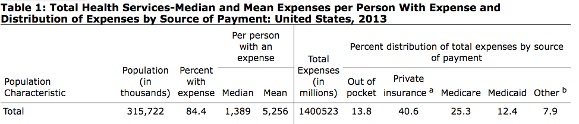
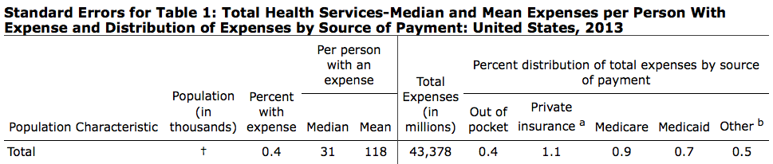
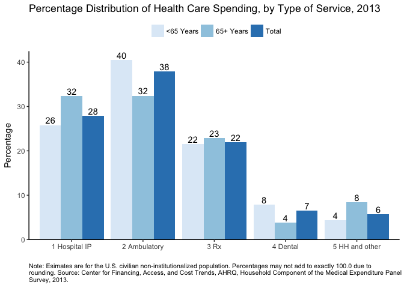

-   [About `meps.hc`](#about-meps.hc)
-   [All MEPS-Related R data packages:](#all-meps-related-r-data-packages)
-   [Installation](#installation)
-   [Usage](#usage)
    -   [Load the datasets](#load-the-datasets)
    -   [Replicate Estimates from the MEPS Summary Table](#replicate-estimates-from-the-meps-summary-table)
        -   [Show variable labels for selected variables](#show-variable-labels-for-selected-variables)
        -   [Estimate total healthcare expenditures in 2013](#estimate-total-healthcare-expenditures-in-2013)
        -   [Total US population in 2013](#total-us-population-in-2013)
        -   [Percent of people with any expense in 2013](#percent-of-people-with-any-expense-in-2013)
        -   [Mean and median expense per person in 2013](#mean-and-median-expense-per-person-in-2013)
        -   [Distribution by source of payment in 2013](#distribution-by-source-of-payment-in-2013)
    -   [Replicate Figure 1 in MEPS Statistical Brief \#491](#replicate-figure-1-in-meps-statistical-brief-491)
        -   [Show variable labels for selected variables](#show-variable-labels-for-selected-variables-1)
        -   [Estimate distribution of expense by TOS in 2013](#estimate-distribution-of-expense-by-tos-in-2013)
        -   [Create the plot](#create-the-plot)
    -   [Analyze MEPS data using Stata](#analyze-meps-data-using-stata)
        -   [Show variable labels for selected variables](#show-variable-labels-for-selected-variables-2)
        -   [Save R `rda` file as Stata `dta` file](#save-r-rda-file-as-stata-dta-file)
        -   [Estimate the total healthcare expenditures in 2014](#estimate-the-total-healthcare-expenditures-in-2014)
        -   [Estimate national expenses by type of service in 2014](#estimate-national-expenses-by-type-of-service-in-2014)
        -   [~~Expenditures and utilization of antipsychotics~~](#expenditures-and-utilization-of-antipsychotics)
        -   [Construct family-level estimates](#construct-family-level-estimates)
        -   [~~Use and expenditures for persons with diabetes~~](#use-and-expenditures-for-persons-with-diabetes)
        -   [~~Expenditures for all events associated with diabetes~~](#expenditures-for-all-events-associated-with-diabetes)
        -   [Pool multiple years of MEPS data](#pool-multiple-years-of-meps-data)
        -   [Construct insurance status variables from monthly insurance variables](#construct-insurance-status-variables-from-monthly-insurance-variables)
        -   [Pool longitudinal files](#pool-longitudinal-files)
    -   [More Examples](#more-examples)

<!-- README.md is generated from README.Rmd. Please edit that file -->
About `meps.hc`
===============

[](https://travis-ci.org/jjchern/meps.hc) [](https://ci.appveyor.com/project/jjchern/meps.hc) [](https://cran.r-project.org/package=meps.hc)

The goal of `meps.hc` is to wrap the Annual Consolidated Data Files from the Medical Expenditure Panel Survey (`meps`) Household Component (`hc`) in an R data package.

All variable labels and value labels are included. Variable names are in lowercase.

For more information about the consolidated MEPS-HC files, see [the AHRQ webpages](https://meps.ahrq.gov/mepsweb/data_stats/download_data_files_results.jsp?cboDataYear=All&cboDataTypeY=1%2CHousehold+Full+Year+File&buttonYearandDataType=Search&cboPufNumber=All&SearchTitle=Consolidated+Data), or the example code from the [`HHS-AHRQ/MEPS` repo](https://github.com/HHS-AHRQ/MEPS) by [`@e-mitchell`](https://github.com/e-mitchell).

For another attempt of downloading the MEPS data, see [the `ajdamico/asdfree` repo](https://github.com/ajdamico/asdfree/tree/master/Medical%20Expenditure%20Panel%20Survey) by [`@ajdamico`](https://github.com/ajdamico).

Currently the package includes data from 2011-2014. The rest of the files (1996-2010) will be packaged soon.

All MEPS-Related R data packages:
=================================

-   Full Year Consolidated Files: [`meps.hc`](https://github.com/jjchern/meps.hc)
-   Person Round Plan Files: [`meps.prpl`](https://github.com/jjchern/meps.prpl)
-   Two-Years Longitudinal Files: [`meps.panel`](https://github.com/jjchern/meps.panel)

Installation
============

``` r
# install.packages("devtools")
devtools::install_github("jjchern/meps.hc")

# To uninstall the package, use:
# remove.packages("meps.hc")
```

Usage
=====

Load the datasets
-----------------

``` r
# Load tibble via tidyverse for better printout
library(tidyverse)

meps.hc::f2014
# A tibble: 34,875 x 1,838
    duid   pid dupersid       panel famid31 famid42 famid53 famid14
   <dbl> <dbl>    <chr>      <fctr>  <fctr>  <fctr>  <fctr>  <fctr>
 1 40001   101 40001101 18 panel 18       A       A       A       A
 2 40001   102 40001102 18 panel 18       A       A       A       A
 3 40001   103 40001103 18 panel 18       A       A       A       A
 4 40001   104 40001104 18 panel 18       A       A       A       A
 5 40002   101 40002101 18 panel 18       A       A       A       A
 6 40004   101 40004101 18 panel 18       A       A       A       A
 7 40004   102 40004102 18 panel 18       A       A       A       A
 8 40004   103 40004103 18 panel 18       A       A       A       A
 9 40004   104 40004104 18 panel 18       A       A       A       A
10 40004   105 40004105 18 panel 18       A       A       A       A
# ... with 34,865 more rows, and 1830 more variables: famidyr <fctr>,
#   cpsfamid <fctr>, fcsz1231 <dbl>, fcrp1231 <fctr>, ruletr31 <fctr>,
#   ruletr42 <fctr>, ruletr53 <fctr>, ruletr14 <fctr>, rusize31 <fctr>,
#   rusize42 <fctr>, rusize53 <fctr>, rusize14 <fctr>, ruclas31 <fctr>,
#   ruclas42 <fctr>, ruclas53 <fctr>, ruclas14 <fctr>, famsze31 <fctr>,
#   famsze42 <fctr>, famsze53 <fctr>, famsze14 <dbl>, fmrs1231 <fctr>,
#   fams1231 <dbl>, famszeyr <dbl>, famrfpyr <fctr>, region31 <fctr>,
#   region42 <fctr>, region53 <fctr>, region14 <fctr>, refprs31 <dbl>,
#   refprs42 <dbl>, refprs53 <dbl>, refprs14 <dbl>, resp31 <fctr>,
#   resp42 <fctr>, resp53 <fctr>, resp14 <fctr>, proxy31 <fctr>,
#   proxy42 <fctr>, proxy53 <fctr>, proxy14 <fctr>, intvlang <fctr>,
#   begrfm31 <fctr>, begrfy31 <fctr>, endrfm31 <fctr>, endrfy31 <fctr>,
#   begrfm42 <fctr>, begrfy42 <fctr>, endrfm42 <fctr>, endrfy42 <fctr>,
#   begrfm53 <fctr>, begrfy53 <fctr>, endrfm53 <fctr>, endrfy53 <fctr>,
#   endrfm14 <fctr>, endrfy14 <fctr>, keyness <fctr>, inscop31 <fctr>,
#   inscop42 <fctr>, inscop53 <fctr>, inscop14 <fctr>, insc1231 <fctr>,
#   inscope <fctr>, elgrnd31 <fctr>, elgrnd42 <fctr>, elgrnd53 <fctr>,
#   elgrnd14 <fctr>, pstats31 <fctr>, pstats42 <fctr>, pstats53 <fctr>,
#   rurslt31 <fctr>, rurslt42 <fctr>, rurslt53 <fctr>, age31x <dbl>,
#   age42x <dbl>, age53x <dbl>, age14x <dbl>, agelast <dbl>, dobmm <fctr>,
#   dobyy <fctr>, sex <fctr>, racev1x <fctr>, racev2x <fctr>,
#   raceax <fctr>, racebx <fctr>, racewx <fctr>, racethx <fctr>,
#   hispanx <fctr>, hispncat <fctr>, marry31x <fctr>, marry42x <fctr>,
#   marry53x <fctr>, marry14x <fctr>, spouid31 <fctr>, spouid42 <fctr>,
#   spouid53 <fctr>, spouid14 <fctr>, spouin31 <fctr>, spouin42 <fctr>,
#   spouin53 <fctr>, spouin14 <fctr>, ...
```

Replicate Estimates from the MEPS Summary Table
-----------------------------------------------

This section replicates the first row of [MEPS summary table for 2013 data](https://meps.ahrq.gov/mepsweb/data_stats/tables_compendia_hh_interactive.jsp?_SERVICE=MEPSSocket0&_PROGRAM=MEPSPGM.TC.SAS&File=HCFY2013&Table=HCFY2013_PLEXP_%40&VAR1=AGE&VAR2=SEX&VAR3=RACETH5C&VAR4=INSURCOV&VAR5=POVCAT13&VAR6=REGION&VAR7=HEALTH&VARO1=4+17+44+64&VARO2=1&VARO3=1&VARO4=1&VARO5=1&VARO6=1&VARO7=1&_Debug=):





The code are modified from

-   [`HHS-AHRQ/MEPS/R:` Analyzing MEPS data using R](https://github.com/HHS-AHRQ/MEPS/tree/master/R), and
-   [`HHS-AHRQ/MEPS/R/example_1.R`](https://github.com/HHS-AHRQ/MEPS/blob/master/R/example_1.R)

### Show variable labels for selected variables

``` r
meps.hc::f2013 %>% 
    select(varpsu, varstr, perwt13f, totexp13,
           totslf13, totptr13, totmcr13, totmcd13,
           totva13, totwcp13, tototh13) %>% 
    labelled::var_label() %>% 
    enframe() %>% 
    unnest() %>% 
    knitr::kable()
```

| name     | value                              |
|:---------|:-----------------------------------|
| varpsu   | variance estimation psu - 2013 .   |
| varstr   | variance estimation stratum - 2013 |
| perwt13f | final person weight, 2013          |
| totexp13 | total health care exp 13           |
| totslf13 | total amt paid by self/family 13   |
| totptr13 | total amt paid by prv & tri 13     |
| totmcr13 | total amt paid by medicare 13      |
| totmcd13 | total amt paid by medicaid 13      |
| totva13  | total amt paid by va/champva 13    |
| totwcp13 | total amt paid by workers comp 13  |
| tototh13 | total amt paid by oth combined 13  |

### Estimate total healthcare expenditures in 2013

``` r
library(survey)

# 'adjust': center the stratum at the population mean 
# rather than the stratum mean
options(survey.lonely.psu = 'adjust')

mepsdsgn = svydesign(id = ~varpsu, # cluster ids
                     strata = ~varstr, 
                     weights = ~perwt13f, # sampling weights
                     data = meps.hc::f2013,
                     nest = TRUE) # enforce nesting within strata

# Replicate estimates reported in 
svytotal(~totexp13, design = mepsdsgn) %>% 
    as_tibble() %>% 
    transmute(`2013 US Tot. Exp. (in millions)` = total / 1000000,
              `Std. Err. (in millions)` = totexp13 / 1000000) %>% 
    knitr::kable()
```

|  2013 US Tot. Exp. (in millions)|  Std. Err. (in millions)|
|--------------------------------:|------------------------:|
|                          1400523|                 43378.01|

### Total US population in 2013

``` r
# Standard errors are not applicable to population control totals, so we don't need to use a survey function here.
# The total population is equal to the sum of survey weights (PERWT13F).
sum(meps.hc::f2013$perwt13f) %>% 
    as_tibble() %>% 
    transmute(`Population (in thousands)` = value / 1000,
              `Std. Err.` = "NA") %>% 
    knitr::kable(digits = 0)
```

|  Population (in thousands)| Std. Err. |
|--------------------------:|:----------|
|                     315722| NA        |

### Percent of people with any expense in 2013

``` r
# To calculate the percent of people with any expense, first update mepsdsgn with a new indicator variable for persons with an expense:
update(mepsdsgn, any_expense = (totexp13 > 0) * 1) -> mepsdsgn

# Then run the 'svymean' function
svymean(~any_expense, design = mepsdsgn) %>% 
    as_tibble() %>% 
    transmute(`Percent with expense` = mean * 100,
              `Std. Err.` = any_expense * 100) %>% 
    knitr::kable(digits = 1)
```

|  Percent with expense|  Std. Err.|
|---------------------:|----------:|
|                  84.4|        0.4|

### Mean and median expense per person in 2013

``` r
# To get expenses per person with an expense, use the 'subset' function to limit the dataset to persons that have an expense (i.e. any_expense == 1).

svymean(~totexp13, design = subset(mepsdsgn, any_expense == 1)) %>% 
    as_tibble() %>% 
    transmute(`Mean (per person with an expense)` = mean,
              `Std. Err.` = totexp13) %>% 
    knitr::kable(digits = 0)
```

|  Mean (per person with an expense)|  Std. Err.|
|----------------------------------:|----------:|
|                               5256|        118|

``` r

svyquantile(~totexp13, 
            design = subset(mepsdsgn, any_expense==1),
            quantiles = 0.5) %>%
    as_tibble() %>% 
    transmute(`Median (per person with an expense)` = `0.5`,
              `Std. Err.` = "NA") %>% 
    knitr::kable()
```

|  Median (per person with an expense)| Std. Err. |
|------------------------------------:|:----------|
|                                 1389| NA        |

### Distribution by source of payment in 2013

``` r

# Before estimating percentages for 'Other' insurance, we need to adjust this variable to match the online table:
# Other = VA + worker's comp + other sources.
update(mepsdsgn, tototh13 = totva13 + totwcp13 + tototh13) -> mepsdsgn

# For percent of total, use the `svyratio` function, and specify the numerator and denominator.
# Use a '+' sign to calculate estimates for multiple variables.
svyratio(~totslf13 + totptr13 + totmcr13 + totmcd13 + tototh13,
         denominator = ~totexp13,
         design = mepsdsgn) %>% 
         {tibble(
             `Percent of total expenses by source of payment` = 
                         coef(.) %>% names(),
             `Estimates` = coef(.) * 100, 
             `Std. Err.` = SE(.) * 100
         )} %>% 
    knitr::kable(digits = 1)
```

| Percent of total expenses by source of payment |  Estimates|  Std. Err.|
|:-----------------------------------------------|----------:|----------:|
| totslf13/totexp13                              |       13.8|        0.4|
| totptr13/totexp13                              |       40.6|        1.1|
| totmcr13/totexp13                              |       25.3|        0.9|
| totmcd13/totexp13                              |       12.4|        0.7|
| tototh13/totexp13                              |        7.9|        0.5|

Replicate Figure 1 in MEPS Statistical Brief \#491
--------------------------------------------------

This section replicates Figure 1 in [MEPS Statistical Brief \#491](https://meps.ahrq.gov/data_files/publications/st491/stat491.shtml)

The code are modified from

-   [`HHS-AHRQ/MEPS/R:` Analyzing MEPS data using R](https://github.com/HHS-AHRQ/MEPS/tree/master/R), and
-   [`HHS-AHRQ/MEPS/R/example_1.R`](https://github.com/HHS-AHRQ/MEPS/blob/master/R/example_1.R)
-   [`HHS-AHRQ/MEPS/R/example_2.R`](https://github.com/HHS-AHRQ/MEPS/blob/master/R/example_2.R)

### Show variable labels for selected variables

``` r
meps.hc::f2013 %>% 
    select(varpsu, varstr, perwt13f, totexp13,
           obvexp13, optexp13, ertexp13,
           hhaexp13, hhnexp13, visexp13, othexp13,
           iptexp13, rxexp13, dvtexp13,
           agelast) %>% 
    labelled::var_label() %>% 
    enframe() %>% 
    unnest() %>% 
    knitr::kable()
```

| name     | value                                   |
|:---------|:----------------------------------------|
| varpsu   | variance estimation psu - 2013 .        |
| varstr   | variance estimation stratum - 2013      |
| perwt13f | final person weight, 2013               |
| totexp13 | total health care exp 13                |
| obvexp13 | total office-based exp 13               |
| optexp13 | total outpatient fac + dr exp 13        |
| ertexp13 | total er facility + dr exp 13           |
| hhaexp13 | total home health agency exp 13         |
| hhnexp13 | total home health non-agncy exp 13      |
| visexp13 | total glasses/contact lens exp 13       |
| othexp13 | tot other equip/sply (excl diab) exp 13 |
| iptexp13 | tot hosp ip facility + dr exp 13        |
| rxexp13  | total rx-exp 13                         |
| dvtexp13 | total dental care exp 13                |
| agelast  | person s age last time eligible         |

### Estimate distribution of expense by TOS in 2013

``` r
# To get ambulatory (OB + OP) and home health/other expenditures, add variables to the mepsdsgn object.
mepsdsgn <- update(mepsdsgn,
                   ambexp13 = obvexp13 + optexp13 + ertexp13,
                   hhexp13  = hhaexp13 + hhnexp13 + visexp13 + othexp13)

# Use svyratio to calculate percentage distribution of spending by type of service:
pct_tos = svyratio(
    ~iptexp13 + ambexp13 + rxexp13 + dvtexp13 + hhexp13,
    denominator = ~totexp13,
    design = mepsdsgn
)

# Now do the same thing by age group (<65, 65+), using the `subset` function.
pct_tos_lt65 = svyratio(
    ~iptexp13 + ambexp13 + rxexp13 + dvtexp13 + hhexp13,
    denominator = ~totexp13,
    design = subset(mepsdsgn, agelast < 65)
)

pct_tos_ge65 = svyratio(
    ~iptexp13 + ambexp13 + rxexp13 + dvtexp13 + hhexp13,
    denominator = ~totexp13,
    design = subset(mepsdsgn, agelast >= 65)
)

# Combine all three tables
tibble(tos = names(coef(pct_tos)),
       pct = coef(pct_tos) * 100,
       age = "Total") -> total
    
tibble(tos = names(coef(pct_tos_lt65)),
       pct = coef(pct_tos_lt65) * 100,
       age = "<65 Years") -> lt65

tibble(tos = names(coef(pct_tos_ge65)),
       pct = coef(pct_tos_ge65) * 100,
       age = "65+ Years") -> ge65

bind_rows(total, lt65, ge65) %>% 
    mutate(tos = case_when(
        grepl("ipt", tos) ~ "1 Hospital IP",
        grepl("amb", tos) ~ "2 Ambulatory",
        grepl("rx" , tos) ~ "3 Rx",
        grepl("dvt", tos) ~ "4 Dental",
        grepl("hh" , tos) ~ "5 HH and other"
    )) -> df

knitr::kable(df)
```

| tos            |        pct| age          |
|:---------------|----------:|:-------------|
| 1 Hospital IP  |  27.911022| Total        |
| 2 Ambulatory   |  37.882294| Total        |
| 3 Rx           |  21.977145| Total        |
| 4 Dental       |   6.556864| Total        |
| 5 HH and other |   5.672677| Total        |
| 1 Hospital IP  |  25.795551| &lt;65 Years |
| 2 Ambulatory   |  40.464733| &lt;65 Years |
| 3 Rx           |  21.540182| &lt;65 Years |
| 4 Dental       |   7.848380| &lt;65 Years |
| 5 HH and other |   4.351155| &lt;65 Years |
| 1 Hospital IP  |  32.383667| 65+ Years    |
| 2 Ambulatory   |  32.422359| 65+ Years    |
| 3 Rx           |  22.900994| 65+ Years    |
| 4 Dental       |   3.826268| 65+ Years    |
| 5 HH and other |   8.466711| 65+ Years    |

### Create the plot

``` r
caption = "Note: Esimates are for the U.S. civilian
non-institutionalized population. Percentages may not add to exactly
100.0 due to rounding. Source: Center for Financing, Access, and Cost
Trends, AHRQ, Household Component of the Medical Expenditure Panel
Survey, 2013." %>% 
    {paste0(strwrap(., 130), sep="", collapse="\n")}

df %>% 
    ggplot(aes(x = tos, y = pct, fill = age)) +
    geom_col(position = "dodge") +
    scale_fill_brewer() +
    labs(y = "Percentage", x = "",
         title = "Percentage Distribution of Health Care Spending, by Type of Service, 2013",
         caption = caption) +
    geom_text(aes(label = round(pct)),
              position = position_dodge(width = 0.9),
              vjust = -0.25) +
    theme_classic() +
    theme(legend.position="top",
          legend.title = element_blank(),
          axis.line.x = element_line(colour = "black"),
          axis.line.y = element_line(colour = "black"),
          plot.caption = element_text(size = 8, hjust = 0)) +
    scale_y_continuous(expand = c(0,0),
                       limits = c(0, max(df$pct) + 2))
```



Analyze MEPS data using Stata
-----------------------------

This section shows Stata code and outputs for analyzing MEPS data. The code are modified from [`HHS-AHQR/MEPS/Stata/exercise_8/`](https://github.com/HHS-AHRQ/MEPS/tree/master/Stata/exercise_8).

### Show variable labels for selected variables

``` r
meps.hc::f2014 %>% 
    select(totexp14, ipdexp14, ipfexp14, obvexp14, 
           rxexp14, opdexp14, opfexp14, dvtexp14, 
           erdexp14, erfexp14, hhaexp14, hhnexp14, 
           othexp14, visexp14, age14x, age42x, 
           age31x, varstr, varpsu, perwt14f,
           dupersid, duid, cpsfamid, famwt14c, 
           totslf14, ttlp14x, inscov14, povcat14,
           racethx) %>% 
    labelled::var_label() %>% 
    enframe() %>% 
    unnest() %>% 
    knitr::kable()
```

| name     | value                                    |
|:---------|:-----------------------------------------|
| totexp14 | total health care exp 14                 |
| ipdexp14 | totl hosp staz dr exp 14                 |
| ipfexp14 | tot hosp ip facility exp-inc 0 nites 14  |
| obvexp14 | total office-based exp 14                |
| rxexp14  | total rx-exp 14                          |
| opdexp14 | total outpatient provider exp 14         |
| opfexp14 | total outpatient facility exp 14         |
| dvtexp14 | total dental care exp 14                 |
| erdexp14 | total emergency room dr exp 14           |
| erfexp14 | total er facility exp 14                 |
| hhaexp14 | total home health agency exp 14          |
| hhnexp14 | total home health non-agncy exp 14       |
| othexp14 | tot other equip/sply (excl diab) exp 14  |
| visexp14 | total glasses/contact lens exp 14        |
| age14x   | age as of 12/31/14 (edited/imputed)      |
| age42x   | age - r4/2 (edited/imputed)              |
| age31x   | age - r3/1 (edited/imputed)              |
| varstr   | variance estimation stratum - 2014       |
| varpsu   | variance estimation psu - 2014 .         |
| perwt14f | final person weight, 2014                |
| dupersid | person id (duid + pid)                   |
| duid     | dwelling unit id                         |
| cpsfamid | cpsfamid                                 |
| famwt14c | pov adj family wgt-cps fam on 12/31/14   |
| totslf14 | total amt paid by self/family 14         |
| ttlp14x  | person s total income                    |
| inscov14 | health insurance coverage indicator 14   |
| povcat14 | family inc as % of poverty line - catego |
| racethx  | race/ethnicity (edited/imputed)          |

### Save R `rda` file as Stata `dta` file

``` r
haven::write_dta(meps.hc::f2014, "README-files/meps_hc_2014.dta")
haven::write_dta(meps.hc::f2013, "README-files/meps_hc_2013.dta")
```

### Estimate the total healthcare expenditures in 2014


    . set more off

    . loc vars dupersid perwt14f varpsu varstr totexp14

    . u `vars' using "README-files/meps_hc_2014.dta", clear

    . svyset varpsu [pweight = perwt14f], str(varstr)

          pweight: perwt14f
              VCE: linearized
      Single unit: missing
         Strata 1: varstr
             SU 1: varpsu
            FPC 1: <zero>

    . svy: total totexp14
    (running total on estimation sample)

    Survey: Total estimation

    Number of strata =     165      Number of obs   =       34,875
    Number of PSUs   =     366      Population size =  318,440,423
                                    Design df       =          201

    --------------------------------------------------------------
                 |             Linearized
                 |      Total   Std. Err.     [95% Conf. Interval]
    -------------+------------------------------------------------
        totexp14 |   1.50e+12   4.98e+10      1.40e+12    1.60e+12
    --------------------------------------------------------------

### Estimate national expenses by type of service in 2014


    . set more off

    . loc vars totexp14 ipdexp14 ipfexp14 obvexp14 rxexp14 opdexp14 opfexp14 dvtexp
    > 14 erdexp14 erfexp14 hhaexp14 hhnexp14 othexp14 visexp14 age14x age42x age31x
    >  varstr varpsu perwt14f 

    . u `vars' using "README-files/meps_hc_2014.dta", clear

    . 
    . * define expenditure variables by type of service
    . gen total                = totexp14

    . gen hospital_inpatient   = ipdexp14 + ipfexp14

    . gen ambulatory           = obvexp14 + opdexp14 + opfexp14 + erdexp14 + erfexp
    > 14

    . gen prescribed_medicines = rxexp14

    . gen dental               = dvtexp14

    . gen home_health_other    = hhaexp14 + hhnexp14 + othexp14 + visexp14

    . gen diff                 = total-hospital_inpatient - ambulatory   - prescrib
    > ed_medicines - dental - home_health_other

    . 
    . * create flag (1/0) variables for persons with an expense, by type of service
    . loc exp_vars total hospital_inpatient ambulatory prescribed_medicines dental 
    > home_health_other

    . foreach var in `exp_vars' {
      2.     gen x_`var' = (`var' > 0)
      3. }

    . 
    . * create a summary variable from end of year, 42, and 31 variables
    . gen age = age14x if age14x >= 0
    (209 missing values generated)

    . replace age = age42x if age42x >= 0 & missing(age)
    (136 real changes made)

    . replace age = age31x if age31x >= 0 & missing(age)
    (73 real changes made)

    . 
    . gen agecat = 1 if age >= 0 & age <= 64
    (4,105 missing values generated)

    . replace agecat = 2 if age>64
    (4,105 real changes made)

    . 
    . * qc check on new variables --------------
    . tab1 x_total x_hospital_inpatient  x_ambulatory  x_prescribed_medicines  x_de
    > ntal  x_home_health_other

    -> tabulation of x_total  

        x_total |      Freq.     Percent        Cum.
    ------------+-----------------------------------
              0 |      7,225       20.72       20.72
              1 |     27,650       79.28      100.00
    ------------+-----------------------------------
          Total |     34,875      100.00

    -> tabulation of x_hospital_inpatient  

    x_hospital_ |
      inpatient |      Freq.     Percent        Cum.
    ------------+-----------------------------------
              0 |     32,682       93.71       93.71
              1 |      2,193        6.29      100.00
    ------------+-----------------------------------
          Total |     34,875      100.00

    -> tabulation of x_ambulatory  

    x_ambulator |
              y |      Freq.     Percent        Cum.
    ------------+-----------------------------------
              0 |     10,531       30.20       30.20
              1 |     24,344       69.80      100.00
    ------------+-----------------------------------
          Total |     34,875      100.00

    -> tabulation of x_prescribed_medicines  

    x_prescribe |
    d_medicines |      Freq.     Percent        Cum.
    ------------+-----------------------------------
              0 |     15,948       45.73       45.73
              1 |     18,927       54.27      100.00
    ------------+-----------------------------------
          Total |     34,875      100.00

    -> tabulation of x_dental  

       x_dental |      Freq.     Percent        Cum.
    ------------+-----------------------------------
              0 |     22,831       65.47       65.47
              1 |     12,044       34.53      100.00
    ------------+-----------------------------------
          Total |     34,875      100.00

    -> tabulation of x_home_health_other  

    x_home_heal |
       th_other |      Freq.     Percent        Cum.
    ------------+-----------------------------------
              0 |     28,936       82.97       82.97
              1 |      5,939       17.03      100.00
    ------------+-----------------------------------
          Total |     34,875      100.00

    . sum total if total>0

        Variable |        Obs        Mean    Std. Dev.       Min        Max
    -------------+---------------------------------------------------------
           total |     27,650    4938.678    14269.34          1     491858

    . sum hospital_inpatient if hospital_inpatient>0

        Variable |        Obs        Mean    Std. Dev.       Min        Max
    -------------+---------------------------------------------------------
    hospital_i~t |      2,193    17536.95    27716.47          3     414748

    . sum ambulatory if ambulatory>0

        Variable |        Obs        Mean    Std. Dev.       Min        Max
    -------------+---------------------------------------------------------
      ambulatory |     24,344    2069.085    6894.936          1     488881

    . sum prescribed_medicines if prescribed_medicines>0

        Variable |        Obs        Mean    Std. Dev.       Min        Max
    -------------+---------------------------------------------------------
    prescribed~s |     18,927    1608.024    5659.345          1     269756

    . sum dental if dental>0

        Variable |        Obs        Mean    Std. Dev.       Min        Max
    -------------+---------------------------------------------------------
          dental |     12,044    654.5071    1349.928          3      38432

    . sum home_health_other if home_health_other>0

        Variable |        Obs        Mean    Std. Dev.       Min        Max
    -------------+---------------------------------------------------------
    home_healt~r |      5,939    1584.149    6493.048          4     172462

    . 
    . list age age14x age42x age31x in 1/20, table

         +--------------------------------+
         | age   age14x   age42x   age31x |
         |--------------------------------|
      1. |  36       36       36       35 |
      2. |  36       36       36       36 |
      3. |  15       15       14       14 |
      4. |   8        8        8        7 |
      5. |  85       85       85       85 |
         |--------------------------------|
      6. |  34       34       33       33 |
      7. |  32       32       31       31 |
      8. |  15       15       14       14 |
      9. |  11       11       10       10 |
     10. |   9        9        8        8 |
         |--------------------------------|
     11. |   4        4        4        3 |
     12. |   8        8        8        7 |
     13. |  20       -1       20       19 |
     14. |  79       79       78       78 |
     15. |  47       47       46       46 |
         |--------------------------------|
     16. |  35       35       35       34 |
     17. |  36       36       36       36 |
     18. |  11       11       11       10 |
     19. |   7        7        7        7 |
     20. |  26       26       25       25 |
         +--------------------------------+

    . 
    . tab agecat

         agecat |      Freq.     Percent        Cum.
    ------------+-----------------------------------
              1 |     30,770       88.23       88.23
              2 |      4,105       11.77      100.00
    ------------+-----------------------------------
          Total |     34,875      100.00

    . sum age if age>64

        Variable |        Obs        Mean    Std. Dev.       Min        Max
    -------------+---------------------------------------------------------
             age |      4,105    73.80682     6.66308         65         85

    . 
    . * identify the survey design characteristics
    . svyset [pweight = perwt14f], strata(varstr) psu(varpsu) vce(linearized) singl
    > eunit(missing)

          pweight: perwt14f
              VCE: linearized
      Single unit: missing
         Strata 1: varstr
             SU 1: varpsu
            FPC 1: <zero>

    . 
    . // percentage distribution of expenses by type of service (stat brief #491 fi
    > gure 1)
    . svy: ratio (hospital_inpatient: hospital_inpatient / total) ///
    >            (ambulatory: ambulatory / total) ///
    >            (prescribed_medicines: prescribed_medicines / total) ///
    >            (dental: dental / total) ///
    >            (home_health_other: home_health_other / total)
    (running ratio on estimation sample)

    Survey: Ratio estimation

    Number of strata =     165      Number of obs   =       34,875
    Number of PSUs   =     366      Population size =  318,440,423
                                    Design df       =          201

     hospital_i~t: hospital_inpatient/total
       ambulatory: ambulatory/total
     prescribed~s: prescribed_medicines/total
           dental: dental/total
     home_healt~r: home_health_other/total

    ----------------------------------------------------------------------
                         |             Linearized
                         |      Ratio   Std. Err.     [95% Conf. Interval]
    ---------------------+------------------------------------------------
      hospital_inpatient |    .254729   .0117416      .2315764    .2778816
              ambulatory |   .3850812   .0092253      .3668904    .4032719
    prescribed_medicines |   .2335445   .0095548      .2147041    .2523849
                  dental |   .0612787   .0021079      .0571223    .0654352
       home_health_other |   .0653674   .0056807       .054166    .0765687
    ----------------------------------------------------------------------

    .            
    . // percentage of persons with an expense, by type of service
    . svy: mean x_total x_hospital_inpatient x_ambulatory x_prescribed_medicines x_
    > dental x_home_health_other
    (running mean on estimation sample)

    Survey: Mean estimation

    Number of strata =     165      Number of obs   =       34,875
    Number of PSUs   =     366      Population size =  318,440,423
                                    Design df       =          201

    ------------------------------------------------------------------------
                           |             Linearized
                           |       Mean   Std. Err.     [95% Conf. Interval]
    -----------------------+------------------------------------------------
                   x_total |   .8512277   .0035374      .8442524    .8582029
      x_hospital_inpatient |   .0657779   .0021471      .0615441    .0700117
              x_ambulatory |   .7590857   .0043806      .7504479    .7677235
    x_prescribed_medicines |   .6135182   .0049526      .6037524    .6232839
                  x_dental |   .4143585   .0059531      .4026199     .426097
       x_home_health_other |   .2040905   .0042286      .1957524    .2124287
    ------------------------------------------------------------------------

    .            
    . // mean expense per person with an expense, by type of service     
    . svy, subpop(x_total): mean total
    (running mean on estimation sample)

    Survey: Mean estimation

    Number of strata =     165      Number of obs   =       34,875
    Number of PSUs   =     366      Population size =  318,440,423
                                    Subpop. no. obs =       26,665
                                    Subpop. size    =  271,065,295
                                    Design df       =          201

    --------------------------------------------------------------
                 |             Linearized
                 |       Mean   Std. Err.     [95% Conf. Interval]
    -------------+------------------------------------------------
           total |   5531.379   137.9266       5259.41    5803.347
    --------------------------------------------------------------

    . svy, subpop(x_hospital_inpatient): mean hospital_inpatient
    (running mean on estimation sample)

    Survey: Mean estimation

    Number of strata =     165      Number of obs   =       34,875
    Number of PSUs   =     366      Population size =  318,440,423
                                    Subpop. no. obs =        2,081
                                    Subpop. size    = 20,946,346.5
                                    Design df       =          201

    --------------------------------------------------------------------
                       |             Linearized
                       |       Mean   Std. Err.     [95% Conf. Interval]
    -------------------+------------------------------------------------
    hospital_inpatient |   18233.81   857.9769      16542.02     19925.6
    --------------------------------------------------------------------

    . svy, subpop(x_ambulatory): mean ambulatory
    (running mean on estimation sample)

    Survey: Mean estimation

    Number of strata =     165      Number of obs   =       34,875
    Number of PSUs   =     366      Population size =  318,440,423
                                    Subpop. no. obs =       23,536
                                    Subpop. size    =  241,723,564
                                    Design df       =          201

    --------------------------------------------------------------
                 |             Linearized
                 |       Mean   Std. Err.     [95% Conf. Interval]
    -------------+------------------------------------------------
      ambulatory |   2388.585   62.53984      2265.266    2511.903
    --------------------------------------------------------------

    . svy, subpop(x_prescribed_medicines): mean prescribed_medicines
    (running mean on estimation sample)

    Survey: Mean estimation

    Number of strata =     165      Number of obs   =       34,875
    Number of PSUs   =     366      Population size =  318,440,423
                                    Subpop. no. obs =       18,311
                                    Subpop. size    =  195,368,984
                                    Design df       =          201

    ----------------------------------------------------------------------
                         |             Linearized
                         |       Mean   Std. Err.     [95% Conf. Interval]
    ---------------------+------------------------------------------------
    prescribed_medicines |   1792.344   83.78614      1627.131    1957.556
    ----------------------------------------------------------------------

    . svy, subpop(x_dental): mean dental
    (running mean on estimation sample)

    Survey: Mean estimation

    Number of strata =     165      Number of obs   =       34,875
    Number of PSUs   =     366      Population size =  318,440,423
                                    Subpop. no. obs =       11,775
                                    Subpop. size    =  131,948,483
                                    Design df       =          201

    --------------------------------------------------------------
                 |             Linearized
                 |       Mean   Std. Err.     [95% Conf. Interval]
    -------------+------------------------------------------------
          dental |   696.3259    15.4452      665.8705    726.7813
    --------------------------------------------------------------

    . svy, subpop(x_home_health_other): mean home_health_other
    (running mean on estimation sample)

    Survey: Mean estimation

    Number of strata =     165      Number of obs   =       34,875
    Number of PSUs   =     366      Population size =  318,440,423
                                    Subpop. no. obs =        5,761
                                    Subpop. size    =   64,990,677
                                    Design df       =          201

    -------------------------------------------------------------------
                      |             Linearized
                      |       Mean   Std. Err.     [95% Conf. Interval]
    ------------------+------------------------------------------------
    home_health_other |   1508.055   139.4998      1232.984    1783.126
    -------------------------------------------------------------------

    . 
    . // mean expense per person with an expense, by type of service and age catego
    > ry
    . svy, subpop(x_total): mean total, over(agecat)
    (running mean on estimation sample)

    Survey: Mean estimation

    Number of strata =     165      Number of obs   =       34,875
    Number of PSUs   =     366      Population size =  318,440,423
                                    Subpop. no. obs =       26,665
                                    Subpop. size    =  271,065,295
                                    Design df       =          201

                1: agecat = 1
                2: agecat = 2

    --------------------------------------------------------------
                 |             Linearized
            Over |       Mean   Std. Err.     [95% Conf. Interval]
    -------------+------------------------------------------------
    total        |
               1 |   4429.921   149.9609      4134.223     4725.62
               2 |      10890   302.6142      10293.29     11486.7
    --------------------------------------------------------------

    . svy, subpop(x_hospital_inpatient): mean hospital_inpatient, over(agecat)
    (running mean on estimation sample)

    Survey: Mean estimation

    Number of strata =     165      Number of obs   =       34,875
    Number of PSUs   =     366      Population size =  318,440,423
                                    Subpop. no. obs =        2,081
                                    Subpop. size    = 20,946,346.5
                                    Design df       =          201

                1: agecat = 1
                2: agecat = 2

    --------------------------------------------------------------------
                       |             Linearized
                  Over |       Mean   Std. Err.     [95% Conf. Interval]
    -------------------+------------------------------------------------
    hospital_inpatient |
                     1 |   17663.08   1263.521      15171.63    20154.54
                     2 |   19191.14    1131.91       16959.2    21423.08
    --------------------------------------------------------------------

    . svy, subpop(x_ambulatory): mean ambulatory, over(agecat)
    (running mean on estimation sample)

    Survey: Mean estimation

    Number of strata =     165      Number of obs   =       34,875
    Number of PSUs   =     366      Population size =  318,440,423
                                    Subpop. no. obs =       23,536
                                    Subpop. size    =  241,723,564
                                    Design df       =          201

                1: agecat = 1
                2: agecat = 2

    --------------------------------------------------------------
                 |             Linearized
            Over |       Mean   Std. Err.     [95% Conf. Interval]
    -------------+------------------------------------------------
    ambulatory   |
               1 |    2055.61   66.80712      1923.877    2187.343
               2 |   3859.418   168.7558      3526.659    4192.177
    --------------------------------------------------------------

    . svy, subpop(x_prescribed_medicines): mean prescribed_medicines, over(agecat)
    (running mean on estimation sample)

    Survey: Mean estimation

    Number of strata =     165      Number of obs   =       34,875
    Number of PSUs   =     366      Population size =  318,440,423
                                    Subpop. no. obs =       18,311
                                    Subpop. size    =  195,368,984
                                    Design df       =          201

                1: agecat = 1
                2: agecat = 2

    ----------------------------------------------------------------------
                         |             Linearized
                    Over |       Mean   Std. Err.     [95% Conf. Interval]
    ---------------------+------------------------------------------------
    prescribed_medicines |
                       1 |   1560.906   106.3327      1351.236    1770.577
                       2 |   2602.126   100.7413       2403.48    2800.771
    ----------------------------------------------------------------------

    . svy, subpop(x_dental): mean dental, over(agecat)
    (running mean on estimation sample)

    Survey: Mean estimation

    Number of strata =     165      Number of obs   =       34,875
    Number of PSUs   =     366      Population size =  318,440,423
                                    Subpop. no. obs =       11,775
                                    Subpop. size    =  131,948,483
                                    Design df       =          201

                1: agecat = 1
                2: agecat = 2

    --------------------------------------------------------------
                 |             Linearized
            Over |       Mean   Std. Err.     [95% Conf. Interval]
    -------------+------------------------------------------------
    dental       |
               1 |     657.05   17.34416      622.8501    691.2498
               2 |   892.5962   44.61207      804.6285    980.5639
    --------------------------------------------------------------

    . svy, subpop(x_home_health_other): mean home_health_other, over(agecat)
    (running mean on estimation sample)

    Survey: Mean estimation

    Number of strata =     165      Number of obs   =       34,875
    Number of PSUs   =     366      Population size =  318,440,423
                                    Subpop. no. obs =        5,761
                                    Subpop. size    =   64,990,677
                                    Design df       =          201

                1: agecat = 1
                2: agecat = 2

    -------------------------------------------------------------------
                      |             Linearized
                 Over |       Mean   Std. Err.     [95% Conf. Interval]
    ------------------+------------------------------------------------
    home_health_other |
                    1 |   1025.308    161.522      706.8131    1343.803
                    2 |   2923.966   209.7328      2510.407    3337.524
    -------------------------------------------------------------------

### ~~Expenditures and utilization of antipsychotics~~

This subsection replicates figures from [statistical brief \#275](https://meps.ahrq.gov/data_files/publications/st275/stat275.shtml)

### Construct family-level estimates

> This exercise illustrates how to construct family level variables from person level data.

> There are two definitions of family unit in MEPS:

> CPS Family: ID is DUID + CPSFAMID. Corresponding weight is FAMWT14C. MEPS Family: ID is DUID + FAMIDYR. Corresponding weight is FAMWT14F. The CPS family is used in this exercise.


    . set more off

    . loc vars dupersid duid cpsfamid famwt14c varstr varpsu totslf14 ttlp14x

    . use `vars' using "README-files/meps_hc_2014.dta", clear

    . 
    . sort duid cpsfamid

    . list duid cpsfamid totslf14 ttlp14x in 1/20, sepby(duid)

         +---------------------------------------+
         |  duid   cpsfamid   totslf14   ttlp14x |
         |---------------------------------------|
      1. | 40001          A        135         0 |
      2. | 40001          A         89         0 |
      3. | 40001          A        165     12000 |
      4. | 40001          A        152     56000 |
         |---------------------------------------|
      5. | 40002          A          2     27030 |
         |---------------------------------------|
      6. | 40004          A         80         0 |
      7. | 40004          A        141         0 |
      8. | 40004          A          0         0 |
      9. | 40004          A          0     12000 |
     10. | 40004          A         12         0 |
     11. | 40004          A          0         0 |
     12. | 40004          A        159         0 |
     13. | 40004          A          0         0 |
         |---------------------------------------|
     14. | 40005          A       2919     39945 |
         |---------------------------------------|
     15. | 40009          A         52     34031 |
         |---------------------------------------|
     16. | 40010          A        210         0 |
     17. | 40010          A        614     84000 |
     18. | 40010          A         56         0 |
     19. | 40010          A         40     56000 |
         |---------------------------------------|
     20. | 40011          A          0         0 |
         +---------------------------------------+

    . 
    . by duid cpsfamid: egen famoop = sum(totslf14)

    . by duid cpsfamid: egen faminc = sum(ttlp14x)

    . by duid cpsfamid: gen  famsize = _N

    . 
    . list duid famwt14c famsize famoop faminc totslf14 ttlp14x in 1/20, sepby(duid
    > )

         +--------------------------------------------------------------------+
         |  duid    famwt14c   famsize   famoop   faminc   totslf14   ttlp14x |
         |--------------------------------------------------------------------|
      1. | 40001    6540.855         4      541    68000        135         0 |
      2. | 40001    6540.855         4      541    68000         89         0 |
      3. | 40001    6540.855         4      541    68000        165     12000 |
      4. | 40001    6540.855         4      541    68000        152     56000 |
         |--------------------------------------------------------------------|
      5. | 40002   8827.9997         1        2    27030          2     27030 |
         |--------------------------------------------------------------------|
      6. | 40004   3883.9568         8      392    12000         80         0 |
      7. | 40004   3883.9568         8      392    12000        141         0 |
      8. | 40004   3883.9568         8      392    12000          0         0 |
      9. | 40004   3883.9568         8      392    12000          0     12000 |
     10. | 40004   3883.9568         8      392    12000         12         0 |
     11. | 40004   3883.9568         8      392    12000          0         0 |
     12. | 40004   3883.9568         8      392    12000        159         0 |
     13. | 40004           0         8      392    12000          0         0 |
         |--------------------------------------------------------------------|
     14. | 40005   4676.8667         1     2919    39945       2919     39945 |
         |--------------------------------------------------------------------|
     15. | 40009   5826.4716         1       52    34031         52     34031 |
         |--------------------------------------------------------------------|
     16. | 40010    7601.436         4      920   140000        210         0 |
     17. | 40010    7601.436         4      920   140000        614     84000 |
     18. | 40010    7601.436         4      920   140000         56         0 |
     19. | 40010    7601.436         4      920   140000         40     56000 |
         |--------------------------------------------------------------------|
     20. | 40011   4747.9969         4        0    22500          0         0 |
         +--------------------------------------------------------------------+

    . 
    . sort duid cpsfamid famwt14c

    . by duid cpsfamid: keep if _n==_N
    (19,875 observations deleted)

    . 
    . list duid cpsfamid famwt14c famsize famoop faminc in 1/20

         +----------------------------------------------------------+
         |  duid   cpsfamid    famwt14c   famsize   famoop   faminc |
         |----------------------------------------------------------|
      1. | 40001          A    6540.855         4      541    68000 |
      2. | 40002          A   8827.9997         1        2    27030 |
      3. | 40004          A   3883.9568         8      392    12000 |
      4. | 40005          A   4676.8667         1     2919    39945 |
      5. | 40009          A   5826.4716         1       52    34031 |
         |----------------------------------------------------------|
      6. | 40010          A    7601.436         4      920   140000 |
      7. | 40011          A   4747.9969         4        0    22500 |
      8. | 40012          A   13579.432         4      177   193561 |
      9. | 40014          A   5232.9521         1      954        0 |
     10. | 40014          B   6675.6329         1        5    14720 |
         |----------------------------------------------------------|
     11. | 40014          C   5180.2438         1        2        0 |
     12. | 40015          A   19589.164         3     2275    99945 |
     13. | 40016          A   4050.4395         3       21    13200 |
     14. | 40017          A   22006.184         3      648   200000 |
     15. | 40019          A   3638.4341         5      833    85536 |
         |----------------------------------------------------------|
     16. | 40020          A   12530.817         5     1941    47881 |
     17. | 40021          A   4682.9354         4      782    20800 |
     18. | 40022          A   1887.6775         1        0    17000 |
     19. | 40022          B   5843.5936         4       37    50000 |
     20. | 40023          A   6209.2947         4     3417    82800 |
         +----------------------------------------------------------+

    . 
    . // tabmiss: user-written command to tabulate missing values
    . tabmiss famsize famoop faminc
        Variable |     Obs       Missings   Feq.Missings    NonMiss   Feq.NonMiss
    -------------+---------------------------------------------------------------
         famsize |   15000           0            0          15000          100
          famoop |   15000           0            0          15000          100
          faminc |   15000           0            0          15000          100

    . 
    . keep if famwt14c > 0
    (867 observations deleted)

    . svyset [pweight = famwt14c], strata(varstr) psu(varpsu) vce(linearized) singl
    > eunit(missing)

          pweight: famwt14c
              VCE: linearized
      Single unit: missing
         Strata 1: varstr
             SU 1: varpsu
            FPC 1: <zero>

    . svy: mean famsize famoop faminc
    (running mean on estimation sample)

    Survey: Mean estimation

    Number of strata =     165      Number of obs   =       14,133
    Number of PSUs   =     365      Population size =  140,282,371
                                    Design df       =          200

    --------------------------------------------------------------
                 |             Linearized
                 |       Mean   Std. Err.     [95% Conf. Interval]
    -------------+------------------------------------------------
         famsize |   2.221791   .0205013      2.181364    2.262217
          famoop |   1279.595   28.96032      1222.488    1336.702
          faminc |   63373.64   1015.978      61370.24    65377.05
    --------------------------------------------------------------

### ~~Use and expenditures for persons with diabetes~~

### ~~Expenditures for all events associated with diabetes~~

### Pool multiple years of MEPS data

Pooling two-years of data requires recalculating personal weights.

> This exercise illustrates how to pool meps data files from different years the example used is population age 26-30 who are uninsured but have high income.

> Data from 2013 and 2014 are pooled.

> Variables with year specific names must be renamed before combining files in this program the insurance coverage variables 'INSCOV13' and 'INSCOV14' are renamed to 'INSCOV'.


    . // rename year specific variables prior to combining files
    . use dupersid inscov13 perwt13f varstr varpsu povcat13 agelast totslf13 using 
    > "README-files/meps_hc_2013.dta", clear

    . rename inscov13 inscov

    . rename perwt13f perwt

    . rename povcat13 povcat

    . rename totslf13 totslf

    . tempfile yr1

    . save "`yr1'"
    file /var/folders/m8/68z5d14d7mv9qyf1bd69ych40000gn/T//St08104.000001 saved

    . 
    . use dupersid inscov14 perwt14f varstr varpsu povcat14 agelast totslf14 using 
    > "README-files/meps_hc_2014.dta", clear

    . rename inscov14 inscov

    . rename perwt14f perwt

    . rename povcat14 povcat

    . rename totslf14 totslf

    . 
    . append using "`yr1'", generate(yearnum)

    . 
    . fre inscov

    inscov -- health insurance coverage indicator 14
    ---------------------------------------------------------------------
                            |      Freq.    Percent      Valid       Cum.
    ------------------------+--------------------------------------------
    Valid   1 1 any private |      35914      50.01      50.01      50.01
            2 2 public only |      24296      33.83      33.83      83.84
            3 3 uninsured   |      11605      16.16      16.16     100.00
            Total           |      71815     100.00     100.00           
    ---------------------------------------------------------------------

    . fre povcat

    povcat -- family inc as % of poverty line - catego
    -----------------------------------------------------------------------
                              |      Freq.    Percent      Valid       Cum.
    --------------------------+--------------------------------------------
    Valid   1 1 poor/negative |      17492      24.36      24.36      24.36
            2 2 near poor     |       4636       6.46       6.46      30.81
            3 3 low income    |      12504      17.41      17.41      48.22
            4 4 middle income |      19791      27.56      27.56      75.78
            5 5 high income   |      17392      24.22      24.22     100.00
            Total             |      71815     100.00     100.00           
    -----------------------------------------------------------------------

    . 
    . gen poolwt = perwt / 2

    . gen subpop = (agelast >= 26 & agelast <= 30 & inscov == 3 & povcat == 5)

    . 
    . tab1 agelast inscov povcat if subpop == 1

    -> tabulation of agelast if subpop == 1 

       person s |
       age last |
           time |
       eligible |      Freq.     Percent        Cum.
    ------------+-----------------------------------
             26 |         29       20.86       20.86
             27 |         39       28.06       48.92
             28 |         23       16.55       65.47
             29 |         31       22.30       87.77
             30 |         17       12.23      100.00
    ------------+-----------------------------------
          Total |        139      100.00

    -> tabulation of inscov if subpop == 1 

           health |
        insurance |
         coverage |
     indicator 14 |      Freq.     Percent        Cum.
    --------------+-----------------------------------
      3 uninsured |        139      100.00      100.00
    --------------+-----------------------------------
            Total |        139      100.00

    -> tabulation of povcat if subpop == 1 

    family inc as % |
    of poverty line |
           - catego |      Freq.     Percent        Cum.
    ----------------+-----------------------------------
      5 high income |        139      100.00      100.00
    ----------------+-----------------------------------
              Total |        139      100.00

    . tab subpop yearnum

               |        yearnum
        subpop |         0          1 |     Total
    -----------+----------------------+----------
             0 |    34,815     36,861 |    71,676 
             1 |        60         79 |       139 
    -----------+----------------------+----------
         Total |    34,875     36,940 |    71,8. summarize

        Variable |        Obs        Mean    Std. Dev.       Min        Max
    -------------+---------------------------------------------------------
        dupersid |          0
         agelast |     71,815      34.882     22.4086          0         85
          povcat |     71,815    3.208243    1.496595          1          5
          inscov |     71,815    1.661505    .7396724          1          3
          totslf |     71,815    421.1674    1447.036          0     108389
    -------------+---------------------------------------------------------
           perwt |     71,815    8830.501    8581.434          0   94410.39
          varstr |     71,815    1084.443    48.94023       1001       1165
          varpsu |     71,815    1.637569    .6163208          1          3
         yearnum |     71,815    .5143772    .4997967          0          1
          poolwt |     71,815     4415.25    4290.717          0    47205.2
    -------------+---------------------------------------------------------
          subpop |     71,815    .0019355    .0439524          0          1

    . tabmiss
        Variable |     Obs       Missings   Feq.Missings    NonMiss   Feq.NonMiss
    -------------+---------------------------------------------------------------
        dupersid |   71815           0            0          71815          100
         agelast |   71815           0            0          71815          100
          povcat |   71815           0            0          71815          100
          inscov |   71815           0            0          71815          100
          totslf |   71815           0            0          71815          100
           perwt |   71815           0            0          71815          100
          varstr |   71815           0            0          71815          100
          varpsu |   71815           0            0          71815          100
         yearnum |   71815           0            0          71815          100
          poolwt |   71815           0            0          71815          100
          subpop |   71815           0            0          71815          100

    . 
    . svyset [pweight = poolwt], strata(varstr) psu(varpsu) vce(linearized) singleu
    > nit(missing)

          pweight: poolwt
              VCE: linearized
      Single unit: missing
         Strata 1: varstr
             SU 1: varpsu
            FPC 1: <zero>

    . 
    . // weighted estimate on totslf for combined data w/age=26-30, uninsured whole
    >  year, and high income
    . svy, subpop(subpop): mean totslf
    (running mean on estimation sample)

    Survey: Mean estimation

    Number of strata =      73      Number of obs   =       37,121
    Number of PSUs   =     169      Population size =  152,825,959
                                    Subpop. no. obs =          114
                                    Subpop. size    = 606,952.6488
                                    Design df       =           96

    --------------------------------------------------------------
                 |             Linearized
                 |       Mean   Std. Err.     [95% Conf. Interval]
    -------------+------------------------------------------------
          totslf |   198.7844   64.22224      71.30424    326.2645
    --------------------------------------------------------------
    Note: 92 strata omitted because they contain no subpopulation
          members.

### Construct insurance status variables from monthly insurance variables

> This exercise illustrates how to construct insurance status variables from monthly insurance variables (see below) in the person level data.

| Variable Name | Description                                |
|---------------|--------------------------------------------|
| TRImm14X      | Covered by TRICARE/CHAMPVA in mm (Ed)      |
| MCRmm14       | Covered by Medicare in mm                  |
| MCRmm14X      | Covered by Medicare in mm (Ed)             |
| MCDmm14       | Covered by Medicaid or SCHIP in mm         |
| MCDmm14X      | Covered by Medicaid or SCHIP in mm (Ed)    |
| OPAmm14       | Covered by Other Public A Ins in mm        |
| OPBmm14       | Covered by Other Public B Ins in mm        |
| PUBmm14X      | Covered by Any Public Ins in mm (Ed)       |
| PEGmm14       | Covered by Empl Union Ins in mm            |
| PDKmm14       | Coverer by Priv Ins (Source Unknown) in mm |
| PNGmm14       | Covered by Nongroup Ins in mm              |
| POGmm14       | Covered by Other Group Ins in mm           |
| PRSmm14       | Covered by Self-Emp Ins in mm              |
| POUmm14       | Covered by Holder Outside of RU in mm      |
| PRImm14       | Covered by Private Ins in mm               |

> where mm = JA-DE (January - December)


    . use dupersid varstr varpsu perwt14f racethx peg??14 pou??14 pdk??14 png??14 p
    > og??14 prs??14 pri??14 ins??14x mcd??14x mcr??14x tri??14x opa??14 opb??14 us
    > ing "README-files/meps_hc_2014.dta", clear

    . 
    . local opalist opaja14 opafe14 opama14 opaap14 opamy14 opaju14 opajl14 opaau14
    >  opase14 opaoc14 opano14 opade14

    . local opblist opbja14 opbfe14 opbma14 opbap14 opbmy14 opbju14 opbjl14 opbau14
    >  opbse14 opboc14 opbno14 opbde14

    . local peglist pegja14 pegfe14 pegma14 pegap14 pegmy14 pegju14 pegjl14 pegau14
    >  pegse14 pegoc14 pegno14 pegde14

    . local trilist trija14x trife14x trima14x triap14x trimy14x triju14x trijl14x 
    > triau14x trise14x trioc14x trino14x tride14x

    . local poulist pouja14 poufe14 pouma14 pouap14 poumy14 pouju14 poujl14 pouau14
    >  pouse14 pouoc14 pouno14 poude14

    . local pdklist pdkja14 pdkfe14 pdkma14 pdkap14 pdkmy14 pdkju14 pdkjl14 pdkau14
    >  pdkse14 pdkoc14 pdkno14 pdkde14

    . local pnglist pngja14 pngfe14 pngma14 pngap14 pngmy14 pngju14 pngjl14 pngau14
    >  pngse14 pngoc14 pngno14 pngde14

    . local poglist pogja14 pogfe14 pogma14 pogap14 pogmy14 pogju14 pogjl14 pogau14
    >  pogse14 pogoc14 pogno14 pogde14

    . local prslist prsja14 prsfe14 prsma14 prsap14 prsmy14 prsju14 prsjl14 prsau14
    >  prsse14 prsoc14 prsno14 prsde14

    . local mcrlist mcrja14x mcrfe14x mcrma14x mcrap14x mcrmy14x mcrju14x mcrjl14x 
    > mcrau14x mcrse14x mcroc14x mcrno14x mcrde14x

    . local mcdlist mcdja14x mcdfe14x mcdma14x mcdap14x mcdmy14x mcdju14x mcdjl14x 
    > mcdau14x mcdse14x mcdoc14x mcdno14x mcdde14x

    . local prilist prija14 prife14 prima14 priap14 primy14 priju14 prijl14 priau14
    >  prise14 prioc14 prino14 pride14

    . local inslist insja14x insfe14x insma14x insap14x insmy14x insju14x insjl14x 
    > insau14x insse14x insoc14x insno14x insde14x

    . 
    . * 1) count number of months with insurance
    . egen pri_n = anycount(`prilist'), v(1)

    . egen ins_n = anycount(`inslist'), v(1)

    . egen unins_n = anycount(`inslist'), v(2)

    . egen mcd_n = anycount(`mcdlist'), v(1)

    . egen mcr_n = anycount(`mcrlist'), v(1)

    . egen tri_n = anycount(`trilist'), v(1)

    . egen ref_n = anycount(`inslist'), v(1 2)

    . 
    . *2) create flags for various types of insu
    . forval i = 1/12 {
      2.        local opa = word("`opalist'",`i')
      3.        local opb = word("`opblist'",`i')
      4.        gen op`i' = (`opa' == 1 | `opb' == 1)
      5.        }

    . egen opab_n = anycount(op1-op12), v(1)

    . 
    . forval i = 1/12 {
      2.        local peg = word("`peglist'",`i')
      3.        local tri = word("`trilist'",`i')
      4.        local pou = word("`poulist'",`i')
      5.        local pdk = word("`pdklist'",`i')
      6.        gen grp`i' = (`peg' == 1 | `tri' == 1 |`pou' == 1 | `pdk' == 1)
      7.        }

    . egen grp_n = anycount(grp1-grp12), v(1)

    . 
    . forval i=1/12 {
      2.        local png = word("`pnglist'",`i')
      3.        local pog = word("`poglist'",`i')
      4.        local prs = word("`prslist'",`i')
      5.        gen ng`i' = (`png' == 1 | `pog' == 1 |`prs' == 1)
      6.        }

    . egen ng_n = anycount(ng1-ng12), v(1)

    . 
    . forval i=1/12 {
      2.        local mcr = word("`mcrlist'",`i')
      3.        local mcd = word("`mcdlist'",`i')
      4.        local opa = word("`opalist'",`i')
      5.        local opb = word("`opblist'",`i')
      6.        gen pub`i' = (`mcr' == 1 | `mcd' == 1 |`opa' == 1 | `opb' == 1)
      7.        }

    . egen pub_n = anycount(pub1-pub12), v(1)

    . 
    . gen full_insu = (unins_n == 0)

    . gen group_ins1 = (grp_n > 0)

    . gen group_ins2 = (grp_n > 0 & grp_n == ref_n)

    . gen ng_ins = (ng_n > 0)

    . 
    . tab1 pri_n ins_n unins_n mcd_n mcr_n tri_n opab_n grp_n ng_n pub_n ref_n 

    -> tabulation of pri_n  

      see notes |      Freq.     Percent        Cum.
    ------------+-----------------------------------
              0 |     33,329       95.57       95.57
              1 |        142        0.41       95.97
              2 |        145        0.42       96.39
              3 |        137        0.39       96.78
              4 |        149        0.43       97.21
              5 |        168        0.48       97.69
              6 |        170        0.49       98.18
              7 |        134        0.38       98.56
              8 |        154        0.44       99.01
              9 |        135        0.39       99.39
             10 |        125        0.36       99.75
             11 |         87        0.25      100.00
    ------------+-----------------------------------
          Total |     34,875      100.00

    -> tabulation of ins_n  

      see notes |      Freq.     Percent        Cum.
    ------------+-----------------------------------
              0 |     33,329       95.57       95.57
              1 |        142        0.41       95.97
              2 |        145        0.42       96.39
              3 |        137        0.39       96.78
              4 |        149        0.43       97.21
              5 |        168        0.48       97.69
              6 |        170        0.49       98.18
              7 |        134        0.38       98.56
              8 |        154        0.44       99.01
              9 |        135        0.39       99.39
             10 |        125        0.36       99.75
             11 |         87        0.25      100.00
    ------------+-----------------------------------
          Total |     34,875      100.00

    -> tabulation of unins_n  

      see notes |      Freq.     Percent        Cum.
    ------------+-----------------------------------
              0 |      4,968       14.25       14.25
              1 |        194        0.56       14.80
              2 |        274        0.79       15.59
              3 |        316        0.91       16.49
              4 |        407        1.17       17.66
              5 |        503        1.44       19.10
              6 |        504        1.45       20.55
              7 |        456        1.31       21.86
              8 |        634        1.82       23.67
              9 |        703        2.02       25.69
             10 |        692        1.98       27.67
             11 |        687        1.97       29.64
             12 |     24,537       70.36      100.00
    ------------+-----------------------------------
          Total |     34,875      100.00

    -> tabulation of mcd_n  

      see notes |      Freq.     Percent        Cum.
    ------------+-----------------------------------
              0 |     33,329       95.57       95.57
              1 |        142        0.41       95.97
              2 |        145        0.42       96.39
              3 |        137        0.39       96.78
              4 |        149        0.43       97.21
              5 |        168        0.48       97.69
              6 |        170        0.49       98.18
              7 |        134        0.38       98.56
              8 |        154        0.44       99.01
              9 |        135        0.39       99.39
             10 |        125        0.36       99.75
             11 |         87        0.25      100.00
    ------------+-----------------------------------
          Total |     34,875      100.00

    -> tabulation of mcr_n  

      see notes |      Freq.     Percent        Cum.
    ------------+-----------------------------------
              0 |     33,329       95.57       95.57
              1 |        142        0.41       95.97
              2 |        145        0.42       96.39
              3 |        137        0.39       96.78
              4 |        149        0.43       97.21
              5 |        168        0.48       97.69
              6 |        170        0.49       98.18
              7 |        134        0.38       98.56
              8 |        154        0.44       99.01
              9 |        135        0.39       99.39
             10 |        125        0.36       99.75
             11 |         87        0.25      100.00
    ------------+-----------------------------------
          Total |     34,875      100.00

    -> tabulation of tri_n  

      see notes |      Freq.     Percent        Cum.
    ------------+-----------------------------------
              0 |     33,329       95.57       95.57
              1 |        142        0.41       95.97
              2 |        145        0.42       96.39
              3 |        137        0.39       96.78
              4 |        149        0.43       97.21
              5 |        168        0.48       97.69
              6 |        170        0.49       98.18
              7 |        134        0.38       98.56
              8 |        154        0.44       99.01
              9 |        135        0.39       99.39
             10 |        125        0.36       99.75
             11 |         87        0.25      100.00
    ------------+-----------------------------------
          Total |     34,875      100.00

    -> tabulation of opab_n  

    op1 op2 op3 |
    op4 op5 op6 |
    op7 op8 op9 |
      op10 op11 |
      op12 == 1 |      Freq.     Percent        Cum.
    ------------+-----------------------------------
              0 |     33,329       95.57       95.57
              1 |        142        0.41       95.97
              2 |        145        0.42       96.39
              3 |        137        0.39       96.78
              4 |        149        0.43       97.21
              5 |        168        0.48       97.69
              6 |        170        0.49       98.18
              7 |        134        0.38       98.56
              8 |        154        0.44       99.01
              9 |        135        0.39       99.39
             10 |        125        0.36       99.75
             11 |         87        0.25      100.00
    ------------+-----------------------------------
          Total |     34,875      100.00

    -> tabulation of grp_n  

      grp1 grp2 |
      grp3 grp4 |
      grp5 grp6 |
      grp7 grp8 |
     grp9 grp10 |
    grp11 grp12 |
           == 1 |      Freq.     Percent        Cum.
    ------------+-----------------------------------
              0 |     33,329       95.57       95.57
              1 |        142        0.41       95.97
              2 |        145        0.42       96.39
              3 |        137        0.39       96.78
              4 |        149        0.43       97.21
              5 |        168        0.48       97.69
              6 |        170        0.49       98.18
              7 |        134        0.38       98.56
              8 |        154        0.44       99.01
              9 |        135        0.39       99.39
             10 |        125        0.36       99.75
             11 |         87        0.25      100.00
    ------------+-----------------------------------
          Total |     34,875      100.00

    -> tabulation of ng_n  

    ng1 ng2 ng3 |
    ng4 ng5 ng6 |
    ng7 ng8 ng9 |
      ng10 ng11 |
      ng12 == 1 |      Freq.     Percent        Cum.
    ------------+-----------------------------------
              0 |     33,329       95.57       95.57
              1 |        142        0.41       95.97
              2 |        145        0.42       96.39
              3 |        137        0.39       96.78
              4 |        149        0.43       97.21
              5 |        168        0.48       97.69
              6 |        170        0.49       98.18
              7 |        134        0.38       98.56
              8 |        154        0.44       99.01
              9 |        135        0.39       99.39
             10 |        125        0.36       99.75
             11 |         87        0.25      100.00
    ------------+-----------------------------------
          Total |     34,875      100.00

    -> tabulation of pub_n  

      pub1 pub2 |
      pub3 pub4 |
      pub5 pub6 |
      pub7 pub8 |
     pub9 pub10 |
    pub11 pub12 |
           == 1 |      Freq.     Percent        Cum.
    ------------+-----------------------------------
              0 |     33,329       95.57       95.57
              1 |        142        0.41       95.97
              2 |        145        0.42       96.39
              3 |        137        0.39       96.78
              4 |        149        0.43       97.21
              5 |        168        0.48       97.69
              6 |        170        0.49       98.18
              7 |        134        0.38       98.56
              8 |        154        0.44       99.01
              9 |        135        0.39       99.39
             10 |        125        0.36       99.75
             11 |         87        0.25      100.00
    ------------+-----------------------------------
          Total |     34,875      100.00

    -> tabulation of ref_n  

      see notes |      Freq.     Percent        Cum.
    ------------+-----------------------------------
              0 |      4,558       13.07       13.07
              1 |        170        0.49       13.56
              2 |        206        0.59       14.15
              3 |        251        0.72       14.87
              4 |        306        0.88       15.74
              5 |        437        1.25       17.00
              6 |        415        1.19       18.19
              7 |        403        1.16       19.34
              8 |        578        1.66       21.00
              9 |        679        1.95       22.95
             10 |        656        1.88       24.83
             11 |        682        1.96       26.78
             12 |     25,534       73.22      100.00
    ------------+-----------------------------------
          Total |     34,875      100.00

    . tab1 full_ins group_ins1 group_ins2 ng_ins

    -> tabulation of full_insu  

      full_insu |      Freq.     Percent        Cum.
    ------------+-----------------------------------
              0 |     29,907       85.75       85.75
              1 |      4,968       14.25      100.00
    ------------+-----------------------------------
          Total |     34,875      100.00

    -> tabulation of group_ins1  

     group_ins1 |      Freq.     Percent        Cum.
    ------------+-----------------------------------
              0 |     33,329       95.57       95.57
              1 |      1,546        4.43      100.00
    ------------+-----------------------------------
          Total |     34,875      100.00

    -> tabulation of group_ins2  

     group_ins2 |      Freq.     Percent        Cum.
    ------------+-----------------------------------
              0 |     34,465       98.82       98.82
              1 |        410        1.18      100.00
    ------------+-----------------------------------
          Total |     34,875      100.00

    -> tabulation of ng_ins  

         ng_ins |      Freq.     Percent        Cum.
    ------------+-----------------------------------
              0 |     33,329       95.57       95.57
              1 |      1,546        4.43      100.00
    ------------+-----------------------------------
          Total |     34,875      100.00

    . tab full_insu unins_n

               |                       see notes
     full_insu |         0          1          2          3          4 |     Total
    -----------+-------------------------------------------------------+----------
             0 |         0        194        274        316        407 |    29,907 
             1 |     4,968          0          0          0          0 |     4,968 
    -----------+-------------------------------------------------------+----------
         Total |     4,968        194        274        316        407 |    34,8           |                       see notes
     full_insu |         5          6          7          8          9 |     Total
    -----------+-------------------------------------------------------+----------
             0 |       503        504        456        634        703 |    29,907 
             1 |         0          0          0          0          0 |     4,968 
    -----------+-------------------------------------------------------+----------
         Total |       503        504        456        634        703 |    34,875 

               |            see notes
     full_insu |        10         11         12 |     Total
    -----------+---------------------------------+----------
             0 |       692        687     24,537 |    29,907 
             1 |         0          0          0 |     4,968 
    -----------+---------------------------------+----------
         Total |       692        687     24,537 |    34,875 


    . tab group_ins1 grp_n

               |   grp1 grp2 grp3 grp4 grp5 grp6 grp7 grp8 grp9 grp10
               |                    grp11 grp12 == 1
    group_ins1 |         0          1          2          3          4 |     Total
    -----------+-------------------------------------------------------+----------
             0 |    33,329          0          0          0          0 |    33,329 
             1 |         0        142        145        137        149 |     1,546 
    -----------+-------------------------------------------------------+----------
         Total |    33,329        142        145        137        149 |    34,875 

               |   grp1 grp2 grp3 grp4 grp5 grp6 grp7 grp8 grp9 grp10
               |                    grp11 grp12 == 1
    group_ins1 |         5          6          7          8          9 |     Total
    -----------+-------------------------------------------------------+----------
             0 |         0          0          0          0          0 |    33,329 
             1 |       168        170        134        154        135 |     1,546 
    -----------+-------------------------------------------------------+----------
         Total |       168        170        134        154        135 |    34,875 

               |  grp1 grp2 grp3 grp4
               |  grp5 grp6 grp7 grp8
               |   grp9 grp10 grp11
               |      grp12 == 1
    group_ins1 |        10         11 |     Total
    -----------+----------------------+----------
             0 |         0          0 |    33,329 
             1 |       125         87 |     1,546 
    -----------+----------------------+----------
         Total |       125         87 |    34,875 


    . tab ng_ins ng_n

               | ng1 ng2 ng3 ng4 ng5 ng6 ng7 ng8 ng9 ng10 ng11 ng12 ==
               |                           1
        ng_ins |         0          1          2          3          4 |     Total
    -----------+-------------------------------------------------------+----------
             0 |    33,329          0          0          0          0 |    33,329 
             1 |         0        142        145        137        149 |     1,546 
    -----------+-------------------------------------------------------+----------
         Total |    33,329        142        145        137        149 |    34,875 

               | ng1 ng2 ng3 ng4 ng5 ng6 ng7 ng8 ng9 ng10 ng11 ng12 ==
               |                           1
        ng_ins |         5          6          7          8          9 |     Total
    -----------+-------------------------------------------------------+----------
             0 |         0          0          0          0          0 |    33,329 
             1 |       168        170        134        154        135 |     1,546 
    -----------+-------------------------------------------------------+----------
         Total |       168        170        134        154        135 |    34,875 

               |  ng1 ng2 ng3 ng4 ng5
               | ng6 ng7 ng8 ng9 ng10
               |    ng11 ng12 == 1
        ng_ins |        10         11 |     Total
    -----------+----------------------+----------
             0 |         0          0 |    33,329 
             1 |       125         87 |     1,546 
    -----------+----------------------+----------
         Total |       125         87 |    34,875 


    . 
    . *3) calculate % of persons covered by insu
    . svyset [pweight=perwt14f], strata(varstr) psu(varpsu) vce(linearized) singleu
    > nit(missing)

          pweight: perwt14f
              VCE: linearized
      Single unit: missing
         Strata 1: varstr
             SU 1: varpsu
            FPC 1: <zero>

    . svy: mean full_insu group_ins1 group_ins2 ng_ins, over(racethx)
    (running mean on estimation sample)

    Survey: Mean estimation

    Number of strata =     165      Number of obs   =       34,875
    Number of PSUs   =     366      Population size =  318,440,423
                                    Design df       =          201

        _subpop_1: racethx = 1 hispanic
        _subpop_2: racethx = 2 non-hispanic white only
        _subpop_3: racethx = 3 non-hispanic black only
        _subpop_4: racethx = 4 non-hispanic asian only
        _subpop_5: racethx = 5 non-hispanic other race or mul

    --------------------------------------------------------------
                 |             Linearized
            Over |       Mean   Std. Err.     [95% Conf. Interval]
    -------------+------------------------------------------------
    full_insu    |
       _subpop_1 |   .2151917   .0101965      .1950859    .2352974
       _subpop_2 |   .0643303   .0037492      .0569375    .0717231
       _subpop_3 |   .1163546   .0064317      .1036724    .1290368
       _subpop_4 |   .0812691   .0086048      .0643018    .0982365
       _subpop_5 |   .0724555   .0122909      .0482198    .0966912
    -------------+------------------------------------------------
    group_ins1   |
       _subpop_1 |   .0264375   .0021425      .0222127    .0306622
       _subpop_2 |   .0223652   .0017007      .0190117    .0257186
       _subpop_3 |   .0287738   .0029039      .0230478    .0344998
       _subpop_4 |    .015177   .0029016      .0094555    .0208985
       _subpop_5 |   .0338332   .0071045      .0198242    .0478421
    -------------+------------------------------------------------
    group_ins2   |
       _subpop_1 |   .0052626   .0008027      .0036799    .0068453
       _subpop_2 |   .0020584   .0004588      .0011537     .002963
       _subpop_3 |    .003538   .0007966      .0019673    .0051087
       _subpop_4 |   .0025967   .0011545      .0003201    .0048732
       _subpop_5 |   .0036661   .0023261     -.0009206    .0082527
    -------------+------------------------------------------------
    ng_ins       |
       _subpop_1 |   .0264375   .0021425      .0222127    .0306622
       _subpop_2 |   .0223652   .0017007      .0190117    .0257186
       _subpop_3 |   .0287738   .0029039      .0230478    .0344998
       _subpop_4 |    .015177   .0029016      .0094555    .0208985
       _subpop_5 |   .0338332   .0071045      .0198242    .0478421
    --------------------------------------------------------------

### Pool longitudinal files

See the example in the [`meps.panel` readme](https://github.com/jjchern/meps.panel#pool-three-panels-of-data).

More Examples
-------------

-   [Transitioning to R: Replicating SAS, Stata, and SUDAAN Analysis Techniques in Health Policy Data](https://journal.r-project.org/archive/2009-2/RJournal_2009-2_Damico.pdf)
