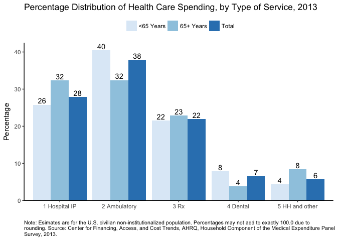

-   [About `meps.hc`](#about-meps.hc)
-   [All MEPS-Related R data packages:](#all-meps-related-r-data-packages)
-   [Installation](#installation)
-   [Usage](#usage)
    -   [Load the datasets](#load-the-datasets)
    -   [Replicate Estimates from the MEPS Summary Table](#replicate-estimates-from-the-meps-summary-table)
        -   [Show variable labels for selected variables](#show-variable-labels-for-selected-variables)
        -   [Estimate total healthcare expenditures in 2013](#estimate-total-healthcare-expenditures-in-2013)
        -   [Total US population in 2013](#total-us-population-in-2013)
        -   [Percent of people with any expense in 2013](#percent-of-people-with-any-expense-in-2013)
        -   [Mean and median expense per person in 2013](#mean-and-median-expense-per-person-in-2013)
        -   [Distribution by source of payment in 2013](#distribution-by-source-of-payment-in-2013)
    -   [Replicate Figure 1 in MEPS Statistical Brief \#491](#replicate-figure-1-in-meps-statistical-brief-491)
        -   [Show variable labels for selected variables](#show-variable-labels-for-selected-variables-1)
        -   [Estimate distribution of expense by TOS in 2013](#estimate-distribution-of-expense-by-tos-in-2013)
        -   [Create the plot](#create-the-plot)

<!-- README.md is generated from README.Rmd. Please edit that file -->
About `meps.hc`
===============

[](https://travis-ci.org/jjchern/meps.hc) [](https://ci.appveyor.com/project/jjchern/meps.hc) [](https://cran.r-project.org/package=meps.hc)

The goal of `meps.hc` is to wrap the Annual Consolidated Data Files from the Medical Expenditure Panel Survey (`meps`) Household Component (`hc`) in an R data package.

All variable labels and value labels are included. Variable names are in lowercase.

For more information about the consolidated MEPS-HC files, see [the AHRQ webpages](https://meps.ahrq.gov/mepsweb/data_stats/download_data_files_results.jsp?cboDataYear=All&cboDataTypeY=1%2CHousehold+Full+Year+File&buttonYearandDataType=Search&cboPufNumber=All&SearchTitle=Consolidated+Data), or the example code from the [`HHS-AHRQ/MEPS` repo](https://github.com/HHS-AHRQ/MEPS) by [`@e-mitchell`](https://github.com/e-mitchell).

For another attempt of downloading the MEPS data, see [the `ajdamico/asdfree` repo](https://github.com/ajdamico/asdfree/tree/master/Medical%20Expenditure%20Panel%20Survey) by [`@ajdamico`](https://github.com/ajdamico).

Currently the package includes data from 2011-2014. The rest of the files (1996-2010) will be packaged soon.

All MEPS-Related R data packages:
=================================

-   Full Year Consolidated Files: [`meps.hc`](https://github.com/jjchern/meps.hc)
-   Person Round Plan Files: [`meps.prpl`](https://github.com/jjchern/meps.prpl)
-   Two-Years Longitudinal Files: [`meps.panel`](https://github.com/jjchern/meps.panel)

Installation
============

``` r
# install.packages("devtools")
devtools::install_github("jjchern/meps.hc")

# To uninstall the package, use:
# remove.packages("meps.hc")
```

Usage
=====

Load the datasets
-----------------

``` r
# Load tibble via tidyverse for better printout
library(tidyverse)

meps.hc::f2014
#> # A tibble: 34,875 x 1,838
#>     duid   pid dupersid       panel famid31 famid42 famid53 famid14
#>    <dbl> <dbl>    <chr>      <fctr>  <fctr>  <fctr>  <fctr>  <fctr>
#>  1 40001   101 40001101 18 panel 18       A       A       A       A
#>  2 40001   102 40001102 18 panel 18       A       A       A       A
#>  3 40001   103 40001103 18 panel 18       A       A       A       A
#>  4 40001   104 40001104 18 panel 18       A       A       A       A
#>  5 40002   101 40002101 18 panel 18       A       A       A       A
#>  6 40004   101 40004101 18 panel 18       A       A       A       A
#>  7 40004   102 40004102 18 panel 18       A       A       A       A
#>  8 40004   103 40004103 18 panel 18       A       A       A       A
#>  9 40004   104 40004104 18 panel 18       A       A       A       A
#> 10 40004   105 40004105 18 panel 18       A       A       A       A
#> # ... with 34,865 more rows, and 1830 more variables: famidyr <fctr>,
#> #   cpsfamid <fctr>, fcsz1231 <dbl>, fcrp1231 <fctr>, ruletr31 <fctr>,
#> #   ruletr42 <fctr>, ruletr53 <fctr>, ruletr14 <fctr>, rusize31 <fctr>,
#> #   rusize42 <fctr>, rusize53 <fctr>, rusize14 <fctr>, ruclas31 <fctr>,
#> #   ruclas42 <fctr>, ruclas53 <fctr>, ruclas14 <fctr>, famsze31 <fctr>,
#> #   famsze42 <fctr>, famsze53 <fctr>, famsze14 <dbl>, fmrs1231 <fctr>,
#> #   fams1231 <dbl>, famszeyr <dbl>, famrfpyr <fctr>, region31 <fctr>,
#> #   region42 <fctr>, region53 <fctr>, region14 <fctr>, refprs31 <dbl>,
#> #   refprs42 <dbl>, refprs53 <dbl>, refprs14 <dbl>, resp31 <fctr>,
#> #   resp42 <fctr>, resp53 <fctr>, resp14 <fctr>, proxy31 <fctr>,
#> #   proxy42 <fctr>, proxy53 <fctr>, proxy14 <fctr>, intvlang <fctr>,
#> #   begrfm31 <fctr>, begrfy31 <fctr>, endrfm31 <fctr>, endrfy31 <fctr>,
#> #   begrfm42 <fctr>, begrfy42 <fctr>, endrfm42 <fctr>, endrfy42 <fctr>,
#> #   begrfm53 <fctr>, begrfy53 <fctr>, endrfm53 <fctr>, endrfy53 <fctr>,
#> #   endrfm14 <fctr>, endrfy14 <fctr>, keyness <fctr>, inscop31 <fctr>,
#> #   inscop42 <fctr>, inscop53 <fctr>, inscop14 <fctr>, insc1231 <fctr>,
#> #   inscope <fctr>, elgrnd31 <fctr>, elgrnd42 <fctr>, elgrnd53 <fctr>,
#> #   elgrnd14 <fctr>, pstats31 <fctr>, pstats42 <fctr>, pstats53 <fctr>,
#> #   rurslt31 <fctr>, rurslt42 <fctr>, rurslt53 <fctr>, age31x <dbl>,
#> #   age42x <dbl>, age53x <dbl>, age14x <dbl>, agelast <dbl>, dobmm <fctr>,
#> #   dobyy <fctr>, sex <fctr>, racev1x <fctr>, racev2x <fctr>,
#> #   raceax <fctr>, racebx <fctr>, racewx <fctr>, racethx <fctr>,
#> #   hispanx <fctr>, hispncat <fctr>, marry31x <fctr>, marry42x <fctr>,
#> #   marry53x <fctr>, marry14x <fctr>, spouid31 <fctr>, spouid42 <fctr>,
#> #   spouid53 <fctr>, spouid14 <fctr>, spouin31 <fctr>, spouin42 <fctr>,
#> #   spouin53 <fctr>, spouin14 <fctr>, ...
```

Replicate Estimates from the MEPS Summary Table
-----------------------------------------------

This section replicates the first row of [MEPS summary table for 2013 data](https://meps.ahrq.gov/mepsweb/data_stats/tables_compendia_hh_interactive.jsp?_SERVICE=MEPSSocket0&_PROGRAM=MEPSPGM.TC.SAS&File=HCFY2013&Table=HCFY2013_PLEXP_%40&VAR1=AGE&VAR2=SEX&VAR3=RACETH5C&VAR4=INSURCOV&VAR5=POVCAT13&VAR6=REGION&VAR7=HEALTH&VARO1=4+17+44+64&VARO2=1&VARO3=1&VARO4=1&VARO5=1&VARO6=1&VARO7=1&_Debug=).

The code are modified from

-   [`HHS-AHRQ/MEPS/R:` Analyzing MEPS data using R](https://github.com/HHS-AHRQ/MEPS/tree/master/R), and
-   [`HHS-AHRQ/MEPS/R/example_1.R`](https://github.com/HHS-AHRQ/MEPS/blob/master/R/example_1.R)

### Show variable labels for selected variables

``` r
meps.hc::f2013 %>% 
    select(varpsu, varstr, perwt13f, totexp13,
           totslf13, totptr13, totmcr13, totmcd13,
           totva13, totwcp13, tototh13) %>% 
    labelled::var_label() %>% 
    enframe() %>% 
    unnest() %>% 
    knitr::kable()
```

| name     | value                              |
|:---------|:-----------------------------------|
| varpsu   | variance estimation psu - 2013 .   |
| varstr   | variance estimation stratum - 2013 |
| perwt13f | final person weight, 2013          |
| totexp13 | total health care exp 13           |
| totslf13 | total amt paid by self/family 13   |
| totptr13 | total amt paid by prv & tri 13     |
| totmcr13 | total amt paid by medicare 13      |
| totmcd13 | total amt paid by medicaid 13      |
| totva13  | total amt paid by va/champva 13    |
| totwcp13 | total amt paid by workers comp 13  |
| tototh13 | total amt paid by oth combined 13  |

### Estimate total healthcare expenditures in 2013

``` r
library(survey)

# 'adjust': center the stratum at the population mean 
# rather than the stratum mean
options(survey.lonely.psu = 'adjust')

mepsdsgn = svydesign(id = ~varpsu, # cluster ids
                     strata = ~varstr, 
                     weights = ~perwt13f, # sampling weights
                     data = meps.hc::f2013,
                     nest = TRUE) # enforce nesting within strata

# Replicate estimates reported in 
svytotal(~totexp13, design = mepsdsgn) %>% 
    as_tibble() %>% 
    transmute(`2013 US Tot. Exp. (in millions)` = total / 1000000,
              `Std. Err. (in millions)` = totexp13 / 1000000) %>% 
    knitr::kable()
```

|  2013 US Tot. Exp. (in millions)|  Std. Err. (in millions)|
|--------------------------------:|------------------------:|
|                          1400523|                 43378.01|

### Total US population in 2013

``` r
# Standard errors are not applicable to population control totals, so we don't need to use a survey function here.
# The total population is equal to the sum of survey weights (PERWT13F).
sum(meps.hc::f2013$perwt13f) %>% 
    as_tibble() %>% 
    transmute(`Population (in thousands)` = value / 1000,
              `Std. Err.` = "NA") %>% 
    knitr::kable(digits = 0)
```

|  Population (in thousands)| Std. Err. |
|--------------------------:|:----------|
|                     315722| NA        |

### Percent of people with any expense in 2013

``` r
# To calculate the percent of people with any expense, first update mepsdsgn with a new indicator variable for persons with an expense:
update(mepsdsgn, any_expense = (totexp13 > 0) * 1) -> mepsdsgn

# Then run the 'svymean' function
svymean(~any_expense, design = mepsdsgn) %>% 
    as_tibble() %>% 
    transmute(`Percent with expense` = mean * 100,
              `Std. Err.` = any_expense * 100) %>% 
    knitr::kable(digits = 1)
```

|  Percent with expense|  Std. Err.|
|---------------------:|----------:|
|                  84.4|        0.4|

### Mean and median expense per person in 2013

``` r
# To get expenses per person with an expense, use the 'subset' function to limit the dataset to persons that have an expense (i.e. any_expense == 1).

svymean(~totexp13, design = subset(mepsdsgn, any_expense == 1)) %>% 
    as_tibble() %>% 
    transmute(`Mean (per person with an expense)` = mean,
              `Std. Err.` = totexp13) %>% 
    knitr::kable(digits = 0)
```

|  Mean (per person with an expense)|  Std. Err.|
|----------------------------------:|----------:|
|                               5256|        118|

``` r

svyquantile(~totexp13, 
            design = subset(mepsdsgn, any_expense==1),
            quantiles = 0.5) %>%
    as_tibble() %>% 
    transmute(`Median (per person with an expense)` = `0.5`,
              `Std. Err.` = "NA") %>% 
    knitr::kable()
```

|  Median (per person with an expense)| Std. Err. |
|------------------------------------:|:----------|
|                                 1389| NA        |

### Distribution by source of payment in 2013

``` r

# Before estimating percentages for 'Other' insurance, we need to adjust this variable to match the online table:
# Other = VA + worker's comp + other sources.
update(mepsdsgn, tototh13 = totva13 + totwcp13 + tototh13) -> mepsdsgn

# For percent of total, use the `svyratio` function, and specify the numerator and denominator.
# Use a '+' sign to calculate estimates for multiple variables.
svyratio(~totslf13 + totptr13 + totmcr13 + totmcd13 + tototh13,
         denominator = ~totexp13,
         design = mepsdsgn) %>% 
         {tibble(
             `Percent of total expenses by source of payment` = 
                         coef(.) %>% names(),
             `Estimates` = coef(.) * 100, 
             `Std. Err.` = SE(.) * 100
         )} %>% 
    knitr::kable(digits = 1)
```

| Percent of total expenses by source of payment |  Estimates|  Std. Err.|
|:-----------------------------------------------|----------:|----------:|
| totslf13/totexp13                              |       13.8|        0.4|
| totptr13/totexp13                              |       40.6|        1.1|
| totmcr13/totexp13                              |       25.3|        0.9|
| totmcd13/totexp13                              |       12.4|        0.7|
| tototh13/totexp13                              |        7.9|        0.5|

Replicate Figure 1 in MEPS Statistical Brief \#491
--------------------------------------------------

This section replicates Figure 1 in [MEPS Statistical Brief \#491](https://meps.ahrq.gov/data_files/publications/st491/stat491.shtml)

The code are modified from

-   [`HHS-AHRQ/MEPS/R:` Analyzing MEPS data using R](https://github.com/HHS-AHRQ/MEPS/tree/master/R), and
-   [`HHS-AHRQ/MEPS/R/example_1.R`](https://github.com/HHS-AHRQ/MEPS/blob/master/R/example_1.R)
-   [`HHS-AHRQ/MEPS/R/example_2.R`](https://github.com/HHS-AHRQ/MEPS/blob/master/R/example_2.R)

### Show variable labels for selected variables

``` r
meps.hc::f2013 %>% 
    select(varpsu, varstr, perwt13f, totexp13,
           obvexp13, optexp13, ertexp13,
           hhaexp13, hhnexp13, visexp13, othexp13,
           iptexp13, rxexp13, dvtexp13,
           agelast) %>% 
    labelled::var_label() %>% 
    enframe() %>% 
    unnest() %>% 
    knitr::kable()
```

| name     | value                                   |
|:---------|:----------------------------------------|
| varpsu   | variance estimation psu - 2013 .        |
| varstr   | variance estimation stratum - 2013      |
| perwt13f | final person weight, 2013               |
| totexp13 | total health care exp 13                |
| obvexp13 | total office-based exp 13               |
| optexp13 | total outpatient fac + dr exp 13        |
| ertexp13 | total er facility + dr exp 13           |
| hhaexp13 | total home health agency exp 13         |
| hhnexp13 | total home health non-agncy exp 13      |
| visexp13 | total glasses/contact lens exp 13       |
| othexp13 | tot other equip/sply (excl diab) exp 13 |
| iptexp13 | tot hosp ip facility + dr exp 13        |
| rxexp13  | total rx-exp 13                         |
| dvtexp13 | total dental care exp 13                |
| agelast  | person s age last time eligible         |

### Estimate distribution of expense by TOS in 2013

``` r
# To get ambulatory (OB + OP) and home health/other expenditures, add variables to the mepsdsgn object.
mepsdsgn <- update(mepsdsgn,
                   ambexp13 = obvexp13 + optexp13 + ertexp13,
                   hhexp13  = hhaexp13 + hhnexp13 + visexp13 + othexp13)

# Use svyratio to calculate percentage distribution of spending by type of service:
pct_tos = svyratio(
    ~iptexp13 + ambexp13 + rxexp13 + dvtexp13 + hhexp13,
    denominator = ~totexp13,
    design = mepsdsgn
)

# Now do the same thing by age group (<65, 65+), using the `subset` function.
pct_tos_lt65 = svyratio(
    ~iptexp13 + ambexp13 + rxexp13 + dvtexp13 + hhexp13,
    denominator = ~totexp13,
    design = subset(mepsdsgn, agelast < 65)
)

pct_tos_ge65 = svyratio(
    ~iptexp13 + ambexp13 + rxexp13 + dvtexp13 + hhexp13,
    denominator = ~totexp13,
    design = subset(mepsdsgn, agelast >= 65)
)

# Combine all three tables
tibble(tos = names(coef(pct_tos)),
       pct = coef(pct_tos) * 100,
       age = "Total") -> total
    
tibble(tos = names(coef(pct_tos_lt65)),
       pct = coef(pct_tos_lt65) * 100,
       age = "<65 Years") -> lt65

tibble(tos = names(coef(pct_tos_ge65)),
       pct = coef(pct_tos_ge65) * 100,
       age = "65+ Years") -> ge65

bind_rows(total, lt65, ge65) %>% 
    mutate(tos = case_when(
        grepl("ipt", tos) ~ "1 Hospital IP",
        grepl("amb", tos) ~ "2 Ambulatory",
        grepl("rx" , tos) ~ "3 Rx",
        grepl("dvt", tos) ~ "4 Dental",
        grepl("hh" , tos) ~ "5 HH and other"
    )) -> df

knitr::kable(df)
```

| tos            |        pct| age          |
|:---------------|----------:|:-------------|
| 1 Hospital IP  |  27.911022| Total        |
| 2 Ambulatory   |  37.882294| Total        |
| 3 Rx           |  21.977145| Total        |
| 4 Dental       |   6.556864| Total        |
| 5 HH and other |   5.672677| Total        |
| 1 Hospital IP  |  25.795551| &lt;65 Years |
| 2 Ambulatory   |  40.464733| &lt;65 Years |
| 3 Rx           |  21.540182| &lt;65 Years |
| 4 Dental       |   7.848380| &lt;65 Years |
| 5 HH and other |   4.351155| &lt;65 Years |
| 1 Hospital IP  |  32.383667| 65+ Years    |
| 2 Ambulatory   |  32.422359| 65+ Years    |
| 3 Rx           |  22.900994| 65+ Years    |
| 4 Dental       |   3.826268| 65+ Years    |
| 5 HH and other |   8.466711| 65+ Years    |

### Create the plot

``` r
caption = "Note: Esimates are for the U.S. civilian
non-institutionalized population. Percentages may not add to exactly
100.0 due to rounding. Source: Center for Financing, Access, and Cost
Trends, AHRQ, Household Component of the Medical Expenditure Panel
Survey, 2013." %>% 
    {paste0(strwrap(., 130), sep="", collapse="\n")}

df %>% 
    ggplot(aes(x = tos, y = pct, fill = age)) +
    geom_col(position = "dodge") +
    scale_fill_brewer() +
    labs(y = "Percentage", x = "",
         title = "Percentage Distribution of Health Care Spending, by Type of Service, 2013",
         caption = caption) +
    geom_text(aes(label = round(pct)),
              position = position_dodge(width = 0.9),
              vjust = -0.25) +
    theme_classic() +
    theme(legend.position="top",
          legend.title = element_blank(),
          axis.line.x = element_line(colour = "black"),
          axis.line.y = element_line(colour = "black"),
          plot.caption = element_text(size = 8, hjust = 0)) +
    scale_y_continuous(expand = c(0,0),
                       limits = c(0, max(df$pct) + 2))
```


